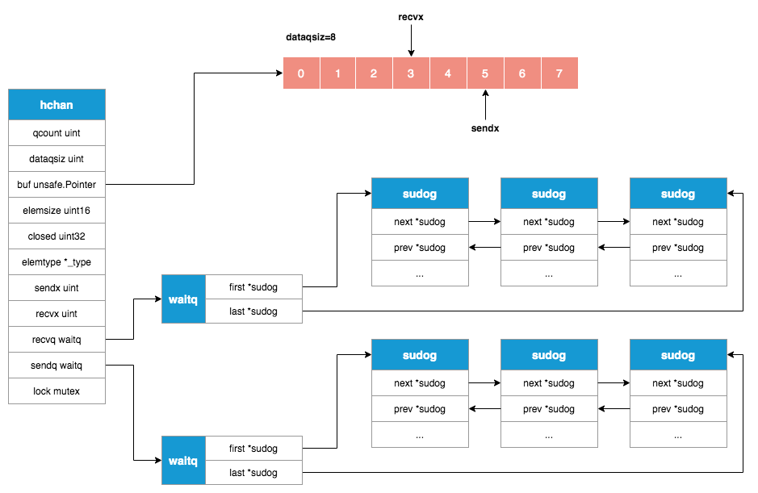

### channel

Go语言中的通道是一个有锁队列，用于连接不同的goroutine。是可以让一个goroutine发送特定值到另一个goroutine的通信机制。

### 数据结构

```go
// runtime/chan.go
type hchan struct {
		// 队列中的元素总个数, len(hchan)
    qcount   uint           // total data in the queue
    // 环形队列的大小, cap(hchan)
    dataqsiz uint           // size of the circular queue
    // 指向环形队列缓冲区数据的指针
    buf      unsafe.Pointer // points to an array of dataqsiz elements
    // 通道能够收发的元素类型大小
    elemsize uint16
    // 通道是否关闭
    closed   uint32
    // 通道能够收发的元素类型
    elemtype *_type // element type
    // 发送操作处理到的位置
    sendx    uint   // send index
    // 接收操作处理到的位置
    recvx    uint   // receive index
    // 阻塞的接收goroutine列表
    recvq    waitq  // list of recv waiters
    // 阻塞的发送goroutine列表
    sendq    waitq  // list of send waiters

    // lock protects all fields in hchan, as well as several
    // fields in sudogs blocked on this channel.
    //
    // Do not change another G's status while holding this lock
    // (in particular, do not ready a G), as this can deadlock
    // with stack shrinking.
    lock mutex
}
```



### 发送数据

向channel发送数据会有3种情况：
	1.	将数据直接发送给接受者
	2.	将数据发送到缓冲区
	3.	发送者陷入阻塞
```go
func chansend(c *hchan, ep unsafe.Pointer, block bool, callerpc uintptr) bool {
	// 向nil channel发送数据会block当前goroutine
	if c == nil {
		if !block {
			return false
		}
		gopark(nil, nil, waitReasonChanSendNilChan, traceEvGoStop, 2)
		throw("unreachable")
	}
	// ...

	lock(&c.lock)
	
	// 向已关闭的通道发送数据会引发panic
	if c.closed != 0 {
		unlock(&c.lock)
		panic(plainError("send on closed channel"))
	}
	
	// 情况1，直接发送
	// 如果接收队列不为空你那个，则从中获取最先进入等待的goroutine(waitq.first)，
	// 并将要发送的元素直接发送给接收goroutine
	// send函数中的sendDirect会直接将要发送的数据copy到接收变量的内存中
	if sg := c.recvq.dequeue(); sg != nil {
		// Found a waiting receiver. We pass the value we want to send
		// directly to the receiver, bypassing the channel buffer (if any).
		send(c, sg, ep, func() { unlock(&c.lock) }, 3)
		return true
	}
	
	// 情况2，通道有缓冲区且缓冲区未满
	// 将要发送的数据存入缓冲队列sendx位置，并且将sendx+1
	// 上述操作完成后如果sendx已经超过了缓冲队列的总长度，那么将sendx移动到队头
	// 将通道中的元素总数量+1
	if c.qcount < c.dataqsiz {
		// Space is available in the channel buffer. Enqueue the element to send.
		qp := chanbuf(c, c.sendx)
		if raceenabled {
			racenotify(c, c.sendx, nil)
		}
		typedmemmove(c.elemtype, qp, ep)
		c.sendx++
		if c.sendx == c.dataqsiz {
			c.sendx = 0
		}
		c.qcount++
		unlock(&c.lock)
		return true
	}

	if !block {
		unlock(&c.lock)
		return false
	}
	
	// 情况3，没有接受者且缓冲队列已满(或没有缓冲队列)
	// 阻塞sender goroutine
	// Block on the channel. Some receiver will complete our operation for us.
	// 获取当前goroutine
	gp := getg()
	// 申请一个*sudog并设置相关信息，如当前goroutine、当前channel，要发送的数据等
	mysg := acquireSudog()
	mysg.releasetime = 0
	if t0 != 0 {
		mysg.releasetime = -1
	}
	// No stack splits between assigning elem and enqueuing mysg
	// on gp.waiting where copystack can find it.
	mysg.elem = ep
	mysg.waitlink = nil
	mysg.g = gp
	mysg.isSelect = false
	mysg.c = c
	gp.waiting = mysg
	gp.param = nil
	// 将携带各种信息的*sudog加入到sendq的队列末尾(sendq.last)
	c.sendq.enqueue(mysg)
	// Signal to anyone trying to shrink our stack that we're about
	// to park on a channel. The window between when this G's status
	// changes and when we set gp.activeStackChans is not safe for
	// stack shrinking.
	atomic.Store8(&gp.parkingOnChan, 1)
	// 使routine进入沉睡状态等待被调度器唤醒
	gopark(chanparkcommit, unsafe.Pointer(&c.lock), waitReasonChanSend, traceEvGoBlockSend, 2)
	// Ensure the value being sent is kept alive until the
	// receiver copies it out. The sudog has a pointer to the
	// stack object, but sudogs aren't considered as roots of the
	// stack tracer.
	KeepAlive(ep)
	
	// 被调度器唤醒后的清理工作
	// someone woke us up.
	if mysg != gp.waiting {
		throw("G waiting list is corrupted")
	}
	gp.waiting = nil
	gp.activeStackChans = false
	closed := !mysg.success
	gp.param = nil
	if mysg.releasetime > 0 {
		blockevent(mysg.releasetime-t0, 2)
	}
	mysg.c = nil
	releaseSudog(mysg)
	if closed {
		if c.closed == 0 {
			throw("chansend: spurious wakeup")
		}
		panic(plainError("send on closed channel"))
	}
	return true
}
```

### 接收数据

从channel接收数据同样有3中情况：
1.	有阻塞的sender goroutine：
		a. 无缓冲区，直接从sender接收数据
		b. 有缓冲区，从缓冲区接收数据，并把sender的数据copy到缓冲区
2. 无阻塞的sender并且缓冲区内有数据：从缓冲区接收数据，并把sender的数据copy到缓冲区
3. 阻塞reciever goroutine

```go
func chanrecv(c *hchan, ep unsafe.Pointer, block bool) (selected, received bool) {
	//...
	
	// 从nil channel接收数据会block当前goroutine
	if c == nil {
		if !block {
			return
		}
		gopark(nil, nil, waitReasonChanReceiveNilChan, traceEvGoStop, 2)
		throw("unreachable")
	}

	lock(&c.lock)
	
	// 如果channel已关闭并且缓冲区中没有数据，那么会清除ep指针并直接返回
	if c.closed != 0 && c.qcount == 0 {
		if raceenabled {
			raceacquire(c.raceaddr())
		}
		unlock(&c.lock)
		if ep != nil {
			typedmemclr(c.elemtype, ep)
		}
		return true, false
	}
	
	// 情况1，如果阻塞的发送队列不为空，从中获取最先进入阻塞的sender goroutine
	// 如果channel没有缓冲区:
	// recv函数中的recvDirect函数会直接将数据从sender中copy到接收变量中
	// 如果channel有缓冲区:
	// 将缓冲区recvx位置的元素copy到接收变量中，并将sender的数据copy到缓存队列中，
	// 然后recvx+1，如果recvx已经超过了缓冲队列的总长度，那么将recvx移动到队头
	// 值得说明的是，有缓冲区并且有阻塞的sender的情况说明队列已经满了，此时sendx与		// recvx应该指向相同的位置
	
	// 无论有没有缓冲区，接收数据完成以后都会唤醒该阻塞的sender
	if sg := c.sendq.dequeue(); sg != nil {
		// Found a waiting sender. If buffer is size 0, receive value
		// directly from sender. Otherwise, receive from head of queue
		// and add sender's value to the tail of the queue (both map to
		// the same buffer slot because the queue is full).
		recv(c, sg, ep, func() { unlock(&c.lock) }, 3)
		return true, true
	}
	
	// 情况2，阻塞的发送队列为空，但是缓冲区内有数据
	// 将缓冲区recvx处的数据copy到接收变量中并清空该槽位
	// recvx+1，如果recvx已经超过了缓冲队列的总长度，那么将recvx移动到队头
	// qcount-1
	if c.qcount > 0 {
		// Receive directly from queue
		qp := chanbuf(c, c.recvx)
		if raceenabled {
			racenotify(c, c.recvx, nil)
		}
		if ep != nil {
			typedmemmove(c.elemtype, ep, qp)
		}
		typedmemclr(c.elemtype, qp)
		c.recvx++
		if c.recvx == c.dataqsiz {
			c.recvx = 0
		}
		c.qcount--
		unlock(&c.lock)
		return true, true
	}

	if !block {
		unlock(&c.lock)
		return false, false
	}
	
	// 情况3，类似发送的过程，阻塞reciever goroutine
	// no sender available: block on this channel.
	gp := getg()
	mysg := acquireSudog()
	mysg.releasetime = 0
	if t0 != 0 {
		mysg.releasetime = -1
	}
	// No stack splits between assigning elem and enqueuing mysg
	// on gp.waiting where copystack can find it.
	mysg.elem = ep
	mysg.waitlink = nil
	gp.waiting = mysg
	mysg.g = gp
	mysg.isSelect = false
	mysg.c = c
	gp.param = nil
	c.recvq.enqueue(mysg)
	// Signal to anyone trying to shrink our stack that we're about
	// to park on a channel. The window between when this G's status
	// changes and when we set gp.activeStackChans is not safe for
	// stack shrinking.
	atomic.Store8(&gp.parkingOnChan, 1)
	gopark(chanparkcommit, unsafe.Pointer(&c.lock), waitReasonChanReceive, traceEvGoBlockRecv, 2)

	// someone woke us up
	if mysg != gp.waiting {
		throw("G waiting list is corrupted")
	}
	gp.waiting = nil
	gp.activeStackChans = false
	if mysg.releasetime > 0 {
		blockevent(mysg.releasetime-t0, 2)
	}
	success := mysg.success
	gp.param = nil
	mysg.c = nil
	releaseSudog(mysg)
	return true, success
}
```

### 关闭channel
关闭channel主要是释放recvq队列里的阻塞读goroutine以及sendq队列里的阻塞写goroutine

```go
func closechan(c *hchan) {
	// 关闭nil channel会引发panic
	if c == nil {
		panic(plainError("close of nil channel"))
	}

	lock(&c.lock)
	// 关闭已处于关闭状态的channel会引发panic
	if c.closed != 0 {
		unlock(&c.lock)
		panic(plainError("close of closed channel"))
	}

	if raceenabled {
		callerpc := getcallerpc()
		racewritepc(c.raceaddr(), callerpc, funcPC(closechan))
		racerelease(c.raceaddr())
	}

	c.closed = 1

	var glist gList

	// 释放recvq阻塞队列里的goroutine
	// release all readers
	for {
		sg := c.recvq.dequeue()
		if sg == nil {
			break
		}
		if sg.elem != nil {
			typedmemclr(c.elemtype, sg.elem)
			sg.elem = nil
		}
		if sg.releasetime != 0 {
			sg.releasetime = cputicks()
		}
		gp := sg.g
		gp.param = unsafe.Pointer(sg)
		sg.success = false
		if raceenabled {
			raceacquireg(gp, c.raceaddr())
		}
		glist.push(gp)
	}
	
	// 释放sendq阻塞队列里的写goroutine
	// release all writers (they will panic)
	for {
		sg := c.sendq.dequeue()
		if sg == nil {
			break
		}
		sg.elem = nil
		if sg.releasetime != 0 {
			sg.releasetime = cputicks()
		}
		gp := sg.g
		gp.param = unsafe.Pointer(sg)
		sg.success = false
		if raceenabled {
			raceacquireg(gp, c.raceaddr())
		}
		glist.push(gp)
	}
	unlock(&c.lock)
	
	// 将所有阻塞的goroutine设置为Grunnable状态
	// Ready all Gs now that we've dropped the channel lock.
	for !glist.empty() {
		gp := glist.pop()
		gp.schedlink = 0
		goready(gp, 3)
	}
}
```

### nil channel与closed channel
- 发送数据
   * `nil channel`: block当前goroutine
   * `closed channel`: panic
- 接收数据
   - `nil channel`: block当前goroutine
   - `closed channel`: 如果缓冲区内有数据，就获取缓冲区内的数据，否则获取对应的零值
- 关闭
   - `nil channel`: panic
   - `closed channel`: panic  
```go
var c chan int
c <- 1 // block
<- c // block
close(c) // panic

var ch = make(chan int, 8)
ch <- 1
close(ch)
println(<-ch) // 1
println(<-ch) // 0，对应int型零值
i, ok := <- ch
println(i, ok) // 0 false
ch <- 1 // panic
close(ch) // panic
```