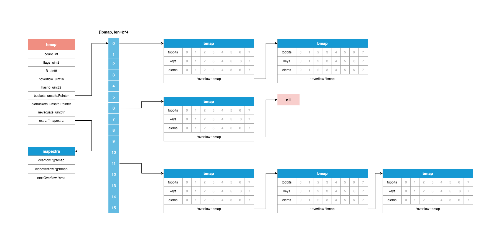
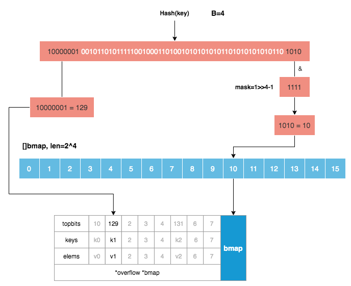

### map

Go使用哈希查找表实现map，使用链表法解决哈希冲突问题。



### 数据结构
```go
// file: runtime/map.go

// A header for a Go map.
type hmap struct {
	// Note: the format of the hmap is also encoded in cmd/compile/internal/gc/reflect.go.
	// Make sure this stays in sync with the compiler's definition.
	count     int // # live cells == size of map.  Must be first (used by len() builtin)
	flags     uint8
	B         uint8  // log_2 of # of buckets (can hold up to loadFactor * 2^B items)
	noverflow uint16 // approximate number of overflow buckets; see incrnoverflow for details
	hash0     uint32 // hash seed
	
	buckets    unsafe.Pointer // array of 2^B Buckets. may be nil if count==0.
	oldbuckets unsafe.Pointer // previous bucket array of half the size, non-nil only when growing
	nevacuate  uintptr        // progress counter for evacuation (buckets less than this have been evacuated)

	extra *mapextra // optional fields
}

// mapextra holds fields that are not present on all maps.
type mapextra struct {
	// If both key and elem do not contain pointers and are inline, then we mark bucket
	// type as containing no pointers. This avoids scanning such maps.
	// However, bmap.overflow is a pointer. In order to keep overflow buckets
	// alive, we store pointers to all overflow buckets in hmap.extra.overflow and hmap.extra.oldoverflow.
	// overflow and oldoverflow are only used if key and elem do not contain pointers.
	// overflow contains overflow buckets for hmap.buckets.
	// oldoverflow contains overflow buckets for hmap.oldbuckets.
	// The indirection allows to store a pointer to the slice in hiter.
	overflow    *[]*bmap
	oldoverflow *[]*bmap

	// nextOverflow holds a pointer to a free overflow bucket.
	nextOverflow *bmap
}

// A bucket for a Go map.
type bmap struct {
	// tophash generally contains the top byte of the hash value
	// for each key in this bucket. If tophash[0] < minTopHash,
	// tophash[0] is a bucket evacuation state instead.
	tophash [bucketCnt]uint8
	// Followed by bucketCnt keys and then bucketCnt elems.
	// NOTE: packing all the keys together and then all the elems together makes the
	// code a bit more complicated than alternating key/elem/key/elem/... but it allows
	// us to eliminate padding which would be needed for, e.g., map[int64]int8.
	// Followed by an overflow pointer.
}
```
`bmap`就是真正存储Key-Value键值对的数据结构--"桶"，编译期间`gc.bmap`(cmd/compile/internal/gc/reflect.go)函数会动态重建bmap桶的结构:

```go
type bmap struct {
    topbits  [8]uint8
    keys     [8]keytype
    elems    [8]elemtype
    overflow uintptr
}
```
每个桶最多可存储8个K-V对。当不同的Key经过哈希函数计算后发生哈希碰撞时，这些Key就会落入相同的桶内，如果桶内的元素超过了8个，就需要新建一个bucket，通过overflow指针连起来，以此类推，形成链表。

### 创建map

```go
// file: runtime/map.go

// makemap_small implements Go map creation for make(map[k]v) and
// make(map[k]v, hint) when hint is known to be at most bucketCnt
// at compile time and the map needs to be allocated on the heap.
func makemap_small() *hmap {
   h := new(hmap)
   h.hash0 = fastrand()
   return h
}

// makemap implements Go map creation for make(map[k]v, hint).
// If the compiler has determined that the map or the first bucket
// can be created on the stack, h and/or bucket may be non-nil.
// If h != nil, the map can be created directly in h.
// If h.buckets != nil, bucket pointed to can be used as the first bucket.
func makemap(t *maptype, hint int, h *hmap) *hmap {
   mem, overflow := math.MulUintptr(uintptr(hint), t.bucket.size)
   if overflow || mem > maxAlloc {
      hint = 0
   }

   // initialize Hmap
   if h == nil {
      h = new(hmap)
   }
   h.hash0 = fastrand()

   // Find the size parameter B which will hold the requested # of elements.
   // For hint < 0 overLoadFactor returns false since hint < bucketCnt.
   B := uint8(0)
   for overLoadFactor(hint, B) {
      B++
   }
   h.B = B

   // allocate initial hash table
   // if B == 0, the buckets field is allocated lazily later (in mapassign)
   // If hint is large zeroing this memory could take a while.
   if h.B != 0 {
      var nextOverflow *bmap
      h.buckets, nextOverflow = makeBucketArray(t, h.B, nil)
      if nextOverflow != nil {
         h.extra = new(mapextra)
         h.extra.nextOverflow = nextOverflow
      }
   }

   return h
}
```


使用make关键字创建map时，以下情况会调用`makemap_small`函数创建map
```go
make(map[k]v)
make(map[k]v, hint) // hint <= bucketCnt(8)
```
否则会调用`makemap`函数来创建。
需注意，`makemap_small`和`makemap`的返回值类型是`*hmap`指针类型，与创建切片的函数`makeslice`直接返回`slice`结构体有所区别（go1.12版本后`makeslice`函数改为直接返回`unsafe.Pointer`类型）。

### 赋值

```go
// Like mapaccess, but allocates a slot for the key if it is not present in the map.
func mapassign(t *maptype, h *hmap, key unsafe.Pointer) unsafe.Pointer {
   // nil map不能进行赋值操作，否则会直接panic
   // var m map[int]int
   // m[1] = 1 // panic!
   if h == nil {
      panic(plainError("assignment to entry in nil map"))
   }
   if raceenabled {
      callerpc := getcallerpc()
      pc := funcPC(mapassign)
      racewritepc(unsafe.Pointer(h), callerpc, pc)
      raceReadObjectPC(t.key, key, callerpc, pc)
   }
   if msanenabled {
      msanread(key, t.key.size)
   }
   // map不是并发安全的，如果其他协程正在进行写操作，会导致panic
   if h.flags&hashWriting != 0 {
      throw("concurrent map writes")
   }
   // 计算key的哈希值，在64位机器上供64个bit位
   hash := t.hasher(key, uintptr(h.hash0))

   // Set hashWriting after calling t.hasher, since t.hasher may panic,
   // in which case we have not actually done a write.
   h.flags ^= hashWriting

   if h.buckets == nil {
      h.buckets = newobject(t.bucket) // newarray(t.bucket, 1)
   }

again:
   // 根据key的哈希值的低B个位计算该key应落在那个桶内
   // 计算掩码，mask = 1<<b - 1
   // 例如b = 4，mask = 1<<4 - 1 = 15，二进制表示为 1111
   // key的哈希值与mask进行按位与计算出桶编号
   bucket := hash & bucketMask(h.B)
   // 如果h.oldbuckets != nil，扩容
   if h.growing() {
      growWork(t, h, bucket)
   }
   // 计算上面的bucket桶具体在内存中的位置
   b := (*bmap)(add(h.buckets, bucket*uintptr(t.bucketsize)))
   // 计算key哈希值的高8位
   top := tophash(hash)

   var inserti *uint8 // key的top哈希值在tophash数组中的位置
   var insertk unsafe.Pointer // key最终存放的位置
   var elem unsafe.Pointer
bucketloop:
   for {
      // 遍历桶中tophash的8个槽位 
      for i := uintptr(0); i < bucketCnt; i++ {
         // 如果key的哈希值的高8位与第i个tophash中存储的值不相等，
         // 并且该槽位是空的，那么就有可能把元素插入到这个位置，
         // 但是由于并没有将整个tophash遍历完，所以需要先记录首次出现的空位置并继续遍历剩下的槽位
         if b.tophash[i] != top {
            if isEmpty(b.tophash[i]) && inserti == nil {
               inserti = &b.tophash[i]
               insertk = add(unsafe.Pointer(b), dataOffset+i*uintptr(t.keysize))
               elem = add(unsafe.Pointer(b), dataOffset+bucketCnt*uintptr(t.keysize)+i*uintptr(t.elemsize))
            }
            if b.tophash[i] == emptyRest {
               break bucketloop
            }
            continue
         }
         // 以下是key的top哈希值能在tophash数组中找到的逻辑
         k := add(unsafe.Pointer(b), dataOffset+i*uintptr(t.keysize))
         if t.indirectkey() {
            k = *((*unsafe.Pointer)(k))
         }
         // 如果该槽位已存在的key跟要插入的key不相等，则跳过本次操作继续查找下一个槽位
         if !t.key.equal(key, k) {
            continue
         }
         // already have a mapping for key. Update it.
         // 找到的位置已经有值，直接更新
         if t.needkeyupdate() {
            typedmemmove(t.key, k, key)
         }
         elem = add(unsafe.Pointer(b), dataOffset+bucketCnt*uintptr(t.keysize)+i*uintptr(t.elemsize))
         goto done
      }
      // bucket的8个槽位遍历完之后还没有找到合适的位置，则去overflow桶里继续找(b=ovf)
      ovf := b.overflow(t)
      // 如果overflow桶是nil，说明所有桶及其overflow桶都遍历完毕，需要分配新的空间存储该key
      if ovf == nil {
         break
      }
      b = ovf
   }
	 
   // Did not find mapping for key. Allocate new cell & add entry.
   
   // If we hit the max load factor or we have too many overflow buckets,
   // and we're not already in the middle of growing, start growing.
   // 为key申请新空间时，如果判断装载因子大于阈值或者溢出桶过多，并且此时不在扩容中，那么触发扩容操作
   // 装载因子判断为uintptr(count) > 13*(bucketShift(B)/2)，即元素个数/桶数量>6.5
   if !h.growing() && (overLoadFactor(h.count+1, h.B) || tooManyOverflowBuckets(h.noverflow, h.B)) {
      // hashGrow函数会判断该次扩容是等量扩容还是增量扩容，并把buckets指针赋给oldbuckets，
      // 真正的扩容操作在growWork函数中完成
      hashGrow(t, h)
      // 扩容后重新计算key应该存储的位置
      goto again // Growing the table invalidates everything, so try again
   }
	 
   // 以上操作过后inserti依然是nil，说明现存的所有桶都是满的，需要新建一个overflow桶来存储新的元素
   if inserti == nil {
      // The current bucket and all the overflow buckets connected to it are full, allocate a new one.
      newb := h.newoverflow(t, b)
      inserti = &newb.tophash[0]
      insertk = add(unsafe.Pointer(newb), dataOffset)
      elem = add(insertk, bucketCnt*uintptr(t.keysize))
   }

   // store new key/elem at insert position
   if t.indirectkey() {
      kmem := newobject(t.key)
      *(*unsafe.Pointer)(insertk) = kmem
      insertk = kmem
   }
   if t.indirectelem() {
      vmem := newobject(t.elem)
      *(*unsafe.Pointer)(elem) = vmem
   }
   typedmemmove(t.key, insertk, key)
   *inserti = top
   h.count++

done:
   if h.flags&hashWriting == 0 {
      throw("concurrent map writes")
   }
   // 操作完成后重置flags状态
   h.flags &^= hashWriting
   if t.indirectelem() {
      elem = *((*unsafe.Pointer)(elem))
   }
   // 返回值应该所在的内存地址，最后由编译器负责将值拷贝到对应区域
   return elem
}
```

### 删除

```go
func mapdelete(t *maptype, h *hmap, key unsafe.Pointer) {
	...
}
```

map的删除操作主要就是定位key在bucket中的位置，过程跟赋值操作中类似，都是通过key的哈希值的低B位确定桶，通过高8位确定桶中的槽位，找到确定位置后将key和elem的内存置位nil，同时清空对应的tophash位；删除操作同样不是并发安全的。

### 扩容

在向map中插入新key的时候，如果定位到的桶已经满了，那么会触发扩容条件检测：

```go
if !h.growing() && (overLoadFactor(h.count+1, h.B) || tooManyOverflowBuckets(h.noverflow, h.B)) {
   hashGrow(t, h)
   goto again // Growing the table invalidates everything, so try again
}
```

1. 装载因子超过阈值6.5，即map中元素总数/桶数量>6.5。每个桶有8个槽位，所有桶都装满的情况下装载因子应该是8，当装载因子大于6.5，说明大部分桶都装满了，此时就会扩容。

```go
// bucketCnt = 8
// loadFactorNum = 13
// loadFactorDen = 2
func overLoadFactor(count int, B uint8) bool {
   return count > bucketCnt && uintptr(count) > loadFactorNum*(bucketShift(B)/loadFactorDen)
}
```

2. overflow溢出桶数量太多。产生过多的溢出桶的典型情况就是频繁的插入和删除元素，因为Go中map没有缩容操作，频繁的插入和删除会使桶的使用比较稀疏。还有中情况是哈希碰撞太严重，极端情况下，如果所有的key哈希值都相同，那么所有元素都会插入到同一个桶及其溢出桶中，此时map也将退化成链表，此时即使执行等量扩容也无法解决效率问题。

```go
func tooManyOverflowBuckets(noverflow uint16, B uint8) bool {
   // If the threshold is too low, we do extraneous work.
   // If the threshold is too high, maps that grow and shrink can hold on to lots of unused memory.
   // "too many" means (approximately) as many overflow buckets as regular buckets.
   // See incrnoverflow for more details.
   if B > 15 {
      B = 15
   }
   // The compiler doesn't see here that B < 16; mask B to generate shorter shift code.
   return noverflow >= uint16(1)<<(B&15)
}
```

触发扩容机制时，会将当前buckets指针赋给oldbuckets，并将当前buckets指向newbuckets。newbuckets的大小根据2中触发扩容的条件有所不同：

1. 如果是装载因子超过阈值触发扩容，那么会将B的值+1，也就是newbuckets大小是原有buckets的两倍。这种情况下的扩容，由于桶的数量变成了原来的2倍，所以用于计算key落在哪个桶里的结果bucket := hash & bucketMask(h.B)也发生了变化，扩容前看哈希值低B位，扩容后要看哈希值低B+1位。这个过程称为rehash。（同样的key在原来的buckets中的序号，与经过rehash之后在newbuckets中的序号可能不同，这也解释了为什么map的遍历是无序的这个问题，而且为了避免歧义，Go在遍历map时，每次都会生成一个随机桶序号开始遍历）

2. 如果是因为溢出桶过多扩容，那么B的值不变，newbuckets大小跟原有buckets相同，执行的是等量扩容。这种情况下的扩容，只是将overflow桶拍平，元素原来在哪个桶里，到新地址后仍然在新序号的桶里。

```go
func hashGrow(t *maptype, h *hmap) {
   // If we've hit the load factor, get bigger.
   // Otherwise, there are too many overflow buckets,
   // so keep the same number of buckets and "grow" laterally.
   // 默认是条件1，，装载因子超过阈值，将B+1
   bigger := uint8(1)
   if !overLoadFactor(h.count+1, h.B) {
      // 条件2，执行等量扩容
      bigger = 0
      h.flags |= sameSizeGrow
   }
   oldbuckets := h.buckets
   newbuckets, nextOverflow := makeBucketArray(t, h.B+bigger, nil)

   flags := h.flags &^ (iterator | oldIterator)
   if h.flags&iterator != 0 {
      flags |= oldIterator
   }
   // commit the grow (atomic wrt gc)
   h.B += bigger
   h.flags = flags
   h.oldbuckets = oldbuckets
   h.buckets = newbuckets
   h.nevacuate = 0
   h.noverflow = 0

   if h.extra != nil && h.extra.overflow != nil {
      // Promote current overflow buckets to the old generation.
      if h.extra.oldoverflow != nil {
         throw("oldoverflow is not nil")
      }
      h.extra.oldoverflow = h.extra.overflow
      h.extra.overflow = nil
   }
   if nextOverflow != nil {
      if h.extra == nil {
         h.extra = new(mapextra)
      }
      h.extra.nextOverflow = nextOverflow
   }

   // the actual copying of the hash table data is done incrementally
   // by growWork() and evacuate().
}
```

hashGrow函数只是申请了新的newbuckets，并没有执行真正的元素迁移操作，具体的元素迁移操作时在插入或删除元素时通过调用growWork函数执行的，并且每次只对2个桶进行迁移操作，执行“渐进式扩容”：

```go
// mapassign和mapdelete函数中的growWork执行具体的元素迁移操作
// h.growing()只判断h.oldbuckets是否为nil，如果不为nil，说明需要扩容
if h.growing() {
   growWork(t, h, bucket)
}

func growWork(t *maptype, h *hmap, bucket uintptr) {
  // make sure we evacuate the oldbucket corresponding
  // to the bucket we're about to use
  // 对当前执行插入或删除操作的桶进行搬迁，evacuate函数每次完成一个桶的搬迁操作
  evacuate(t, h, bucket&h.oldbucketmask())

  // evacuate one more oldbucket to make progress on growing
  // 再计算出一个需要搬迁的老的桶
  if h.growing() {
  	evacuate(t, h, h.nevacuate)
  }
}
```

### 取值

map有两种取值方式：

```go
func main() {
  m := make(map[string]int)
  m["hello"] = 1

  // 不带`,`的取值方式，如果key在map中不存在，则取到的是对应类型的零值，此处为int的零值0
  v1 := m["hello"]
  fmt.Println(v1) // 1
  v2 := m["hi"]
  fmt.Println(v2) // 0

  // 带`,`的取值方式，除获取key对应的值外，还返回key是否存在于map中的布尔值
  // 当map中可能存有0值时，如 m["hi"]=0，这种方式可以区别存储的本身是零值还是对应key不存在
  v3, ok := m["hi"]
  fmt.Println(v3, ok) // 0 false
}
```

这两种取值方式分别对应源码里的`mapaccess1,mapaccess2`函数（在做pprof分析性能的时候，可以根据这两个函数反定位到需要优化的代码）:

```go
func mapaccess1(t *maptype, h *hmap, key unsafe.Pointer) unsafe.Pointer
func mapaccess2(t *maptype, h *hmap, key unsafe.Pointer) (unsafe.Pointer, bool)
```

这两个函数的核心逻辑依然是通过哈希值定位到桶的过程，需要注意的是，如果map处于扩容过程中，那么要重新定位bucket：

```go
hash := t.hasher(key, uintptr(h.hash0))
m := bucketMask(h.B)
b := (*bmap)(add(h.buckets, (hash&m)*uintptr(t.bucketsize)))
// 如果map处于扩容状态
if c := h.oldbuckets; c != nil {
  // 非等量扩容情况下，桶数是原来的2倍，掩码值要右移一位
  if !h.sameSizeGrow() {
    // There used to be half as many buckets; mask down one more power of two.
    m >>= 1
  }
  // 在oldbuckets中重新定位桶
  oldb := (*bmap)(add(c, (hash&m)*uintptr(t.bucketsize)))
  // 如果这个旧的桶还没有搬迁完成，那么该次取值操作在这个旧桶中查找
  if !evacuated(oldb) {
    b = oldb
  }
}
```


### key的定位过程



### 并发安全性

map是非并发安全的，在执行赋值、取值、删除、迭代等操作时，如果有其他goroutine正在执行写操作，那么会引发程序panic：

```go
// 例如在迭代map时有其他goroutine正在写
if h.flags&hashWriting != 0 {
    throw("concurrent map iteration and map write")
}
```

