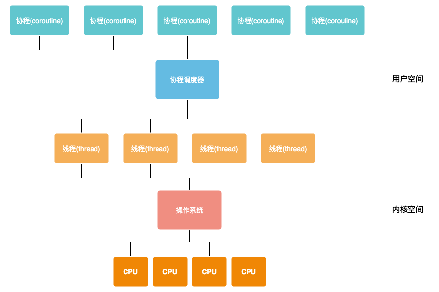
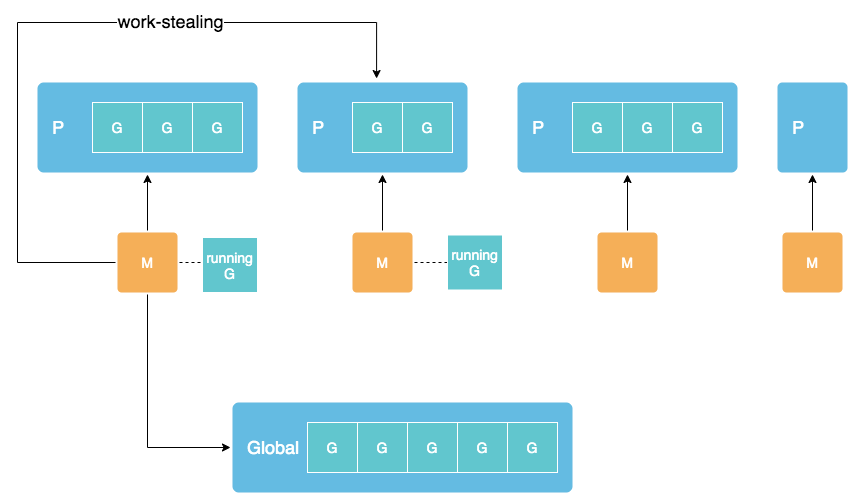
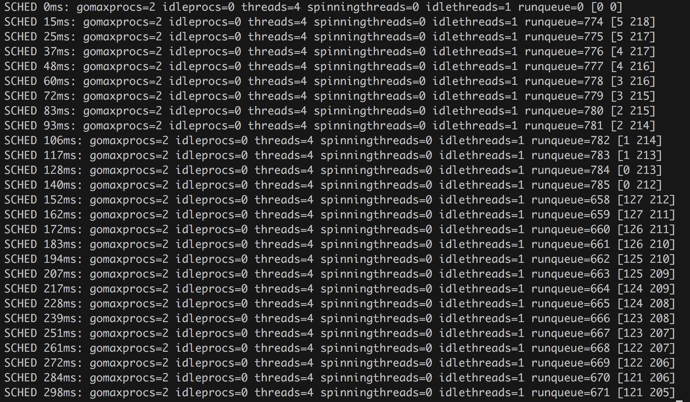

### 线程&协程

线程

* 操作系统调度
* 抢占式

协程

* 用户实现的调度器调度
* 协作式



### GMP

* `G - Goroutine`，Go语言中的协程，由用户通过go关键字定义 
* `M - Machine`，执行实体，对应操作系统线程 
* `P - Processor`，执行任务时所需的资源及上下文，以及拥有一个本地G队列；M必须通过P才能获取并运行G

M是运行goroutine的实体，调度器通过将M绑定到P，通过P不断寻找可执行的G来执行:


1. M会优先从绑定P的本地队列获取G来执行，如果绑定P的本地队列为空，M会尝试从全局G队列获取一部分放到本地队列，或从其他P窃取一部分G放到本地队列
2. P的个数可由`GOMAXPROCS`环境变量配置，默认等于CPU核心数
3. P的本地G队列容量是有限制的，容量满了之后新创建的G会被放入全局队列：

```go
// file: main.go
package main

import (
	"sync"
)

func main() {
	var wg sync.WaitGroup
	for i := 1; i < 1000; i++ {
		wg.Add(1)
		go func() {
			defer wg.Done()
			work()
		}()
	}
	wg.Wait()
}

func work() {
	var counter int
	for i := 0; i < 1e10; i++ {
		counter++
	}
}
```
编译：

`go build main.go`

Debug方式运行，输出调度信息，其中1000表示没1000ms输出一次debug信息：

`GOMAXPROCS=2 GODEBUG=schedtrace=1000 ./main`


* `SCHED 0ms`:  程序启动到输出调试信息过去的时间
* `gomaxprocs`: P的最大值，由`GOMAXPROCS`指定，默认为CPU核心数
* `idleprocs`: 空闲的P数量
* `threads`: 操作系统线程数
* `spinningthreads`: 自旋的操作系统线程数
* `idlethreads`: 空闲的操作系统线程数
* `runqueue`: 全局队列中的G数量
* `[0 0]`: P对应的本地队列中的G数量，当本地队列已满时，新生成的G会被压进全局队列中，`runqueue`的数量就会增加

